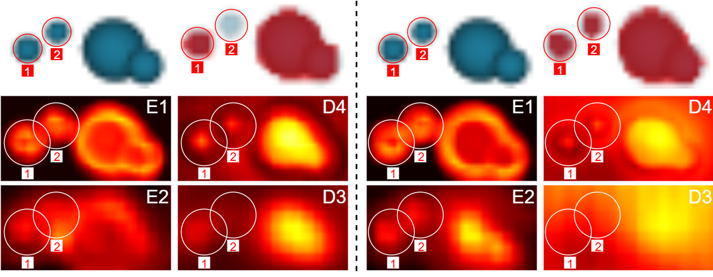

# Preserving Droplet Structures with Gaussian Blur in U-Net

This repository contains the official PyTorch implementation for the paper: "[Preserving Fine-Grained Droplet Structures by Spatial Gaussian Blurring Against Pooling Deformation in U-Net-Based Semantic Segmentation](https://ieeexplore.ieee.org/document/11394763)" published in IEEE Access 2024.



## Project Summary

This work addresses a core challenge in semantic segmentation: the loss of small object information due to aggressive downsampling. We propose a simple, two-fold approach to mitigate this pooling-induced feature loss: (1) an input-level Gaussian blur pre-processing step, and (2) a lightweight graph convolution module at the U-Net bottleneck. Our method is designed to enhance the segmentation of fine-scale structures, such as small droplets in liquid sprays.

## Key Results

Our method significantly improves segmentation performance, particularly for fine-grained objects. The table below summarizes the key results on our liquid spray dataset, using contour accuracy as the primary metric.

| Method | Contour Accuracy (%) |
| :------- | :------: |
| Standard U-Net | 28.40
| U-Net + Gaussian Blur | 31.89
| U-Net + Graph Convolution (UNet-GC) | 29.04
| Our Method (U-Net + Blur + GCN) | 33.09

Our full model achieves a 16.5% relative improvement over the standard U-Net baseline. Ablation studies confirm that Gaussian blurring is the dominant contributor to this gain, with the graph module offering complementary improvements.

## Citation

If you find this work useful, please consider citing our paper:

```
@article{lim2026preserving,
  author   = {Lim, Wei Lun and Teow, Matthew Y. W. and Wong, Richard T. K. and Lau, Sian Lun},
  title    = {Preserving Fine-Scale Droplet Structures by Spatial Gaussian Blurring Against Pooling Deformation in U-Net-Based Semantic Segmentation},
  journal  = {IEEE Access},
  volume   = {14},
  pages    = {25354-25369},
  year     = {2026}
}
```
